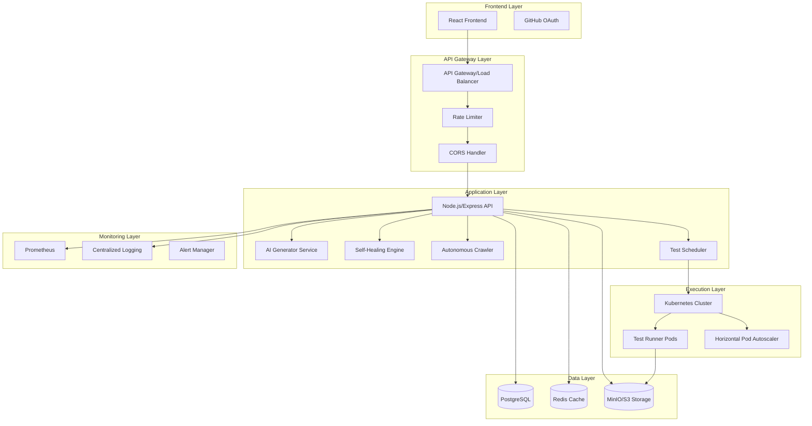

# Design Document: AutoQA Pilot

## Overview

AutoQA Pilot is a production-grade AI-powered autonomous web testing platform built with enterprise-level quality standards. The system combines modern containerization, AI-driven test generation, and self-healing capabilities to provide reliable, scalable test automation.

The architecture follows microservices patterns with strict separation of concerns, comprehensive security measures, and production-ready operational practices. Every component is designed with the "1000 concurrent users" principle in mind, ensuring robust performance under load.

## Architecture

### High-Level Architecture



### Production Quality Standards Integration

The design incorporates the comprehensive production checklist across all layers:

**Database & ORM Layer:**
- Connection pooling with leak detection
- Query optimization with N+1 prevention
- Proper indexing strategy with composite indexes
- UTC timezone consistency
- Soft delete filtering
- Transaction boundary management
- Deadlock prevention through consistent ordering

**Performance & Caching:**
- Redis-based caching with TTL management
- Cache stampede prevention
- Hot-key distribution
- Payload optimization
- Async I/O patterns
- Connection pool management

**Security & Concurrency:**
- AES-256 encryption for sensitive data
- Idempotency keys for critical operations
- Race condition prevention
- SSRF protection
- Rate limiting with Redis
- JWT with proper expiry/refresh
- Input validation and sanitization

## Components and Interfaces

### 1. Frontend Application (React)

**Technology Stack:**
- React 18 with TypeScript
- Vite for build optimization
- TanStack Query for state management
- Tailwind CSS for styling

**Production Standards:**
- Memory leak prevention (cleanup of listeners/timers)
- State management from single source
- Loading/error/empty states for all UI components
- Double-click/multi-submit prevention
- Offline scenario handling
- List virtualization for large datasets
- Accessibility compliance (WCAG 2.1)

**Key Features:**
- GitHub OAuth integration
- Real-time test execution monitoring
- Drag-and-drop test scenario editor
- Visual regression comparison interface
- Project management dashboard

### 2. API Gateway & Load Balancer

**Technology Stack:**
- NGINX or AWS ALB
- Redis for rate limiting
- JWT validation middleware

**Production Standards:**
- CORS configuration with explicit origins
- Rate limiting per user/IP with Redis backend
- Request/response logging with correlation IDs
- Circuit breaker pattern for downstream services
- Timeout configuration (30s for API, 5m for test execution)
- Health check endpoints

**Security Features:**
- API key validation for webhook endpoints
- Request size limits (10MB max)
- SQL injection prevention
- XSS protection headers
- CSRF token validation

### 3. Core API Service (Node.js/Express)

**Technology Stack:**
- Node.js 20+ with TypeScript
- Express.js with Helmet security middleware
- Prisma ORM with PostgreSQL
- Bull Queue for job processing
- Winston for structured logging

**Production Standards:**
- Connection pool configuration (min: 2, max: 20)
- Query optimization with explain analyze monitoring
- N+1 query prevention through eager loading
- Proper error handling without exception swallowing
- Correlation ID propagation
- Graceful shutdown handling
- Health check endpoints with dependency checks

**API Endpoints:**
```typescript
// Project Management
POST /api/projects - Create new project
GET /api/projects - List user projects
PUT /api/projects/:id - Update project
DELETE /api/projects/:id - Delete project

// Test Scenarios
POST /api/projects/:id/scenarios - Create test scenario
GET /api/projects/:id/scenarios - List scenarios
PUT /api/scenarios/:id - Update scenario
DELETE /api/scenarios/:id - Delete scenario

// Test Execution
POST /api/scenarios/:id/execute - Execute test
GET /api/executions/:id - Get execution status
GET /api/executions/:id/logs - Stream execution logs

// Webhooks
POST /api/webhooks/execute - Trigger test via webhook
GET /api/webhooks/status/:id - Get webhook execution status
```

### 4. AI Generator Service

**Technology Stack:**
- OpenAI GPT-4 or Claude API
- Playwright code generation templates
- Input validation and sanitization

**Production Standards:**
- API rate limiting with exponential backoff
- Timeout handling (30s max per generation)
- Input sanitization to prevent prompt injection
- Generated code validation before storage
- Retry logic with jitter for API failures
- Circuit breaker for AI service failures

**Core Functionality:**
- Natural language to Playwright code conversion
- Code syntax validation
- Test step preview generation
- Assertion generation from user requirements

### 5. Self-Healing Engine

**Technology Stack:**
- Computer vision libraries (OpenCV)
- DOM analysis algorithms
- Machine learning models for element matching

**Production Standards:**
- Fallback strategies for element location
- Performance optimization for image comparison
- Memory management for large DOM snapshots
- Concurrent processing limits
- Detailed logging of healing attempts
- Rollback capability for failed healing

**Healing Strategies:**
1. CSS selector alternatives (ID, class, attribute)
2. XPath fallbacks
3. Text content matching
4. Visual element recognition
5. Structural position analysis

### 6. Autonomous Crawler

**Technology Stack:**
- Playwright for browser automation
- Cheerio for HTML parsing
- URL validation and normalization

**Production Standards:**
- Robots.txt compliance
- Rate limiting to prevent site overload
- Concurrent request limits (max 5 per domain)
- Timeout handling (30s per page)
- Memory management for large sites
- Duplicate URL detection
- Error recovery and retry logic

**Crawling Features:**
- Sitemap generation
- Broken link detection
- JavaScript error capture
- Performance metrics collection
- Security vulnerability scanning

### 7. Test Runner (Kubernetes Pods)

**Technology Stack:**
- Docker containers with Playwright
- Kubernetes for orchestration
- Horizontal Pod Autoscaler (HPA)
- Resource limits and requests

**Production Standards:**
- Container isolation with non-root user
- Resource limits (CPU: 1 core, Memory: 2GB)
- Network policies for SSRF prevention
- Automatic cleanup after execution
- Distroless base images for security
- Read-only filesystem where possible
- Security context with dropped capabilities

**Container Configuration:**
```yaml
apiVersion: v1
kind: Pod
spec:
  securityContext:
    runAsNonRoot: true
    runAsUser: 1000
    fsGroup: 1000
  containers:
  - name: test-runner
    image: autoqa/test-runner:latest
    securityContext:
      allowPrivilegeEscalation: false
      readOnlyRootFilesystem: true
      capabilities:
        drop:
        - ALL
    resources:
      requests:
        memory: "1Gi"
        cpu: "500m"
      limits:
        memory: "2Gi"
        cpu: "1"
```

**HPA Configuration:**
- Min replicas: 2
- Max replicas: 50
- Target CPU utilization: 70%
- Scale-up stabilization: 60s
- Scale-down stabilization: 300s
- Custom metrics: queue length, test duration

### 8. Visual Regression Engine

**Technology Stack:**
- Playwright screenshot capabilities
- Image comparison algorithms (pixelmatch)
- MinIO/S3 for baseline storage

**Production Standards:**
- Efficient image storage with compression
- Parallel comparison processing
- Memory optimization for large images
- Baseline versioning and rollback
- Difference threshold configuration
- Batch processing for multiple comparisons

**Comparison Features:**
- Pixel-perfect comparison
- Layout shift detection
- Color difference analysis
- Ignore regions configuration
- Approval workflow for changes

## Data Models

### Database Schema (PostgreSQL)

```sql
-- Users table
CREATE TABLE users (
    id UUID PRIMARY KEY DEFAULT gen_random_uuid(),
    github_id INTEGER UNIQUE NOT NULL,
    username VARCHAR(255) NOT NULL,
    email VARCHAR(255),
    avatar_url TEXT,
    created_at TIMESTAMP WITH TIME ZONE DEFAULT NOW(),
    updated_at TIMESTAMP WITH TIME ZONE DEFAULT NOW()
);

-- Projects table
CREATE TABLE projects (
    id UUID PRIMARY KEY DEFAULT gen_random_uuid(),
    user_id UUID NOT NULL REFERENCES users(id) ON DELETE CASCADE,
    name VARCHAR(255) NOT NULL,
    url TEXT NOT NULL,
    auth_credentials BYTEA, -- AES-256 encrypted
    created_at TIMESTAMP WITH TIME ZONE DEFAULT NOW(),
    updated_at TIMESTAMP WITH TIME ZONE DEFAULT NOW(),
    deleted_at TIMESTAMP WITH TIME ZONE
);

-- Test scenarios table
CREATE TABLE test_scenarios (
    id UUID PRIMARY KEY DEFAULT gen_random_uuid(),
    project_id UUID NOT NULL REFERENCES projects(id) ON DELETE CASCADE,
    name VARCHAR(255) NOT NULL,
    description TEXT,
    natural_language_input TEXT NOT NULL,
    generated_code TEXT NOT NULL,
    is_active BOOLEAN DEFAULT true,
    created_at TIMESTAMP WITH TIME ZONE DEFAULT NOW(),
    updated_at TIMESTAMP WITH TIME ZONE DEFAULT NOW(),
    deleted_at TIMESTAMP WITH TIME ZONE
);

-- Test executions table
CREATE TABLE test_executions (
    id UUID PRIMARY KEY DEFAULT gen_random_uuid(),
    scenario_id UUID NOT NULL REFERENCES test_scenarios(id) ON DELETE CASCADE,
    status VARCHAR(50) NOT NULL DEFAULT 'queued',
    started_at TIMESTAMP WITH TIME ZONE,
    completed_at TIMESTAMP WITH TIME ZONE,
    error_message TEXT,
    execution_logs JSONB,
    screenshots_path TEXT,
    created_at TIMESTAMP WITH TIME ZONE DEFAULT NOW()
);

-- Indexes for performance
CREATE INDEX idx_projects_user_id ON projects(user_id) WHERE deleted_at IS NULL;
CREATE INDEX idx_scenarios_project_id ON test_scenarios(project_id) WHERE deleted_at IS NULL;
CREATE INDEX idx_executions_scenario_id ON test_executions(scenario_id);
CREATE INDEX idx_executions_status ON test_executions(status);
CREATE INDEX idx_executions_created_at ON test_executions(created_at);

-- Composite index for common queries
CREATE INDEX idx_projects_user_active ON projects(user_id, created_at) WHERE deleted_at IS NULL;
```

### Redis Data Structures

```typescript
// Rate limiting
interface RateLimitData {
  key: string; // user_id:endpoint
  count: number;
  ttl: number;
}

// Test execution queue
interface TestJob {
  id: string;
  scenarioId: string;
  userId: string;
  priority: number;
  attempts: number;
  createdAt: Date;
}

// Cache structures
interface ProjectCache {
  key: string; // project:${projectId}
  data: Project;
  ttl: number; // 1 hour
}

interface UserSessionCache {
  key: string; // session:${sessionId}
  userId: string;
  permissions: string[];
  ttl: number; // 24 hours
}
```

### File Storage Structure (MinIO/S3)

```
autoqa-storage/
├── screenshots/
│   ├── {execution_id}/
│   │   ├── step_1.png
│   │   ├── step_2.png
│   │   └── final.png
├── baselines/
│   ├── {scenario_id}/
│   │   ├── v1/
│   │   └── v2/
├── execution-logs/
│   ├── {execution_id}/
│   │   ├── console.log
│   │   ├── network.har
│   │   └── dom_snapshot.html
└── reports/
    ├── {execution_id}/
    │   └── report.html
```

## Error Handling

### Error Classification and Response Strategy

**1. Client Errors (4xx)**
- Input validation failures
- Authentication/authorization errors
- Resource not found errors
- Rate limit exceeded

**2. Server Errors (5xx)**
- Database connection failures
- External service timeouts
- Resource exhaustion
- Unexpected application errors

**3. Test Execution Errors**
- Browser launch failures
- Element not found errors
- Network connectivity issues
- Timeout errors

### Error Response Format

```typescript
interface ErrorResponse {
  error: {
    code: string;
    message: string;
    details?: any;
    correlationId: string;
    timestamp: string;
  };
}

// Example responses
{
  "error": {
    "code": "VALIDATION_ERROR",
    "message": "Invalid project URL format",
    "details": {
      "field": "url",
      "value": "invalid-url"
    },
    "correlationId": "req_123456789",
    "timestamp": "2024-01-15T10:30:00Z"
  }
}
```

### Retry and Circuit Breaker Patterns

**Retry Configuration:**
- Max retries: 3
- Backoff strategy: Exponential with jitter
- Retry conditions: Network errors, 5xx responses, timeouts
- Non-retryable: 4xx client errors (except 429)

**Circuit Breaker Configuration:**
- Failure threshold: 5 failures in 60 seconds
- Recovery timeout: 30 seconds
- Half-open state: Allow 3 test requests
- Metrics: Success rate, response time, error count

### Graceful Degradation

**AI Service Failures:**
- Fallback to template-based code generation
- Queue requests for retry when service recovers
- Notify users of reduced functionality

**Database Failures:**
- Read-only mode with cached data
- Queue write operations for retry
- Health check endpoint reflects degraded state

**Container Orchestration Failures:**
- Fallback to single-node execution
- Queue tests for retry when capacity returns
- Alert operations team immediately

## Testing Strategy

### Dual Testing Approach

The testing strategy combines unit tests for specific scenarios and property-based tests for comprehensive coverage across all inputs. This approach ensures both concrete bug detection and general correctness validation.

**Unit Testing Focus:**
- Specific examples demonstrating correct behavior
- Integration points between components
- Edge cases and error conditions
- Authentication and authorization flows
- Database transaction boundaries

**Property-Based Testing Focus:**
- Universal properties that hold for all inputs
- Comprehensive input coverage through randomization
- Data consistency across operations
- API contract validation
- Security property verification

### Testing Framework Configuration

**Unit Testing Stack:**
- Jest for JavaScript/TypeScript testing
- Supertest for API endpoint testing
- Testcontainers for database integration tests
- React Testing Library for frontend components

**Property-Based Testing Stack:**
- fast-check for JavaScript property testing
- Minimum 100 iterations per property test
- Custom generators for domain-specific data
- Shrinking for minimal failing examples

**Property Test Configuration:**
```typescript
// Example property test configuration
describe('AutoQA Property Tests', () => {
  it('should maintain data consistency across operations', () => {
    fc.assert(
      fc.property(
        fc.record({
          name: fc.string({ minLength: 1, maxLength: 255 }),
          url: fc.webUrl(),
          userId: fc.uuid()
        }),
        (projectData) => {
          // Property: Creating then reading a project returns equivalent data
          const created = createProject(projectData);
          const retrieved = getProject(created.id);
          return deepEqual(created, retrieved);
        }
      ),
      { numRuns: 100 }
    );
  });
});
```

### Test Environment Management

**Database Testing:**
- Isolated test database per test suite
- Transaction rollback for unit tests
- Database seeding with realistic data
- Migration testing in CI/CD pipeline

**Container Testing:**
- Docker-in-Docker for integration tests
- Resource limit validation
- Security context verification
- Network isolation testing

**End-to-End Testing:**
- Playwright for browser automation
- Test data management and cleanup
- Visual regression testing
- Performance benchmarking

### Continuous Integration Pipeline

**Pre-commit Hooks:**
- Code formatting (Prettier)
- Linting (ESLint, TypeScript)
- Unit test execution
- Security scanning (npm audit)

**CI/CD Pipeline Stages:**
1. **Build Stage:** Compile TypeScript, build Docker images
2. **Test Stage:** Unit tests, integration tests, property tests
3. **Security Stage:** Vulnerability scanning, dependency audit
4. **Deploy Stage:** Staging deployment, E2E tests, production deployment

**Quality Gates:**
- Minimum 80% code coverage
- Zero high-severity security vulnerabilities
- All property tests must pass
- Performance benchmarks within acceptable limits
- Database migration compatibility verified

## Correctness Properties

*A property is a characteristic or behavior that should hold true across all valid executions of a system—essentially, a formal statement about what the system should do. Properties serve as the bridge between human-readable specifications and machine-verifiable correctness guarantees.*

Based on the prework analysis and property reflection, the following correctness properties ensure the AutoQA Pilot system maintains reliability and consistency across all operations:

### Authentication and Project Management Properties

**Property 1: Project CRUD Operations Consistency**
*For any* valid project data and authenticated user, creating a project then reading it should return equivalent data, and all CRUD operations should maintain data integrity
**Validates: Requirements 1.4, 1.6**

**Property 2: Credential Encryption Round Trip**
*For any* authentication credentials stored in the system, encrypting then decrypting should produce the original credentials, and all stored credentials should be AES-256 encrypted in the database
**Validates: Requirements 1.5, 9.1**

### AI-Powered Test Generation Properties

**Property 3: Natural Language to Code Generation**
*For any* valid natural language test instruction, the AI_Generator should produce syntactically valid Playwright code that can be executed without compilation errors
**Validates: Requirements 2.1, 2.5**

**Property 4: Test Scenario Manipulation Consistency**
*For any* generated test scenario, adding assertions or editing through drag-and-drop should result in a valid, executable test scenario that maintains the original intent
**Validates: Requirements 2.2, 2.3, 2.4**

### Autonomous Crawling Properties

**Property 5: Site Scanning Completeness**
*For any* valid web application URL, the Autonomous_Crawler should generate a comprehensive site map and respect robots.txt while detecting all accessible pages
**Validates: Requirements 3.1, 3.2, 3.5**

**Property 6: Error Detection and Reporting**
*For any* website containing broken links or JavaScript errors, the scanning process should detect and report them with specific URLs, error codes, and stack traces
**Validates: Requirements 3.3, 3.4**

### Self-Healing Engine Properties

**Property 7: Element Location Healing**
*For any* test with changed element selectors, the Self_Healing_Engine should attempt alternative location strategies and update the test scenario when successful
**Validates: Requirements 4.1, 4.2**

**Property 8: Healing Event Logging**
*For any* self-healing attempt (successful or failed), the system should log the changes and provide appropriate user notifications or debugging information
**Validates: Requirements 4.3, 4.4, 4.5**

### Test Execution and Scaling Properties

**Property 9: Container Isolation and Cleanup**
*For any* test execution, the Test_Runner should execute in completely isolated Docker containers and automatically clean up all resources upon completion
**Validates: Requirements 5.1, 5.4, 9.2, 9.3**

**Property 10: Load Distribution and Scaling**
*For any* number of queued tests, the system should distribute them across available containers and scale worker containers automatically based on queue length
**Validates: Requirements 5.2, 5.5**

**Property 11: Real-time Execution Feedback**
*For any* test execution, the system should provide real-time console output and maintain execution state visibility throughout the process
**Validates: Requirements 5.3**

### Reporting and Artifact Management Properties

**Property 12: Comprehensive Artifact Capture**
*For any* test execution, the system should capture screenshots at each step, and for failed tests, capture DOM snapshots and network logs at the failure point
**Validates: Requirements 6.1, 6.2**

**Property 13: Report Generation and Storage**
*For any* completed test execution, the system should generate a comprehensive report with timeline and visual evidence, and store all artifacts in MinIO/S3
**Validates: Requirements 6.3, 6.4, 6.5**

### Visual Regression Testing Properties

**Property 14: Visual Comparison Round Trip**
*For any* successful test execution, capturing baseline screenshots then comparing subsequent runs should accurately detect visual differences and calculate difference percentages
**Validates: Requirements 7.1, 7.2, 7.3**

**Property 15: Visual Regression Workflow**
*For any* detected visual differences, the system should mark tests as failed with visual evidence and allow users to approve changes as new baselines
**Validates: Requirements 7.4, 7.5**

### Scheduling and Automation Properties

**Property 16: Schedule Management Consistency**
*For any* valid cron-like time specification, the system should execute scheduled tests at the correct time and maintain accurate scheduling history
**Validates: Requirements 8.1, 8.2, 8.5**

**Property 17: Notification Delivery**
*For any* completed or failed scheduled test, the system should send appropriate notifications via configured channels with relevant execution details
**Validates: Requirements 8.3, 8.4**

### Security and Network Protection Properties

**Property 18: Rate Limiting Enforcement**
*For any* API endpoint, the system should enforce rate limiting using Redis-based throttling and prevent abuse through consistent request throttling
**Validates: Requirements 9.4**

**Property 19: SSRF Protection**
*For any* test execution, the Test_Runner should only access target websites and be prevented from accessing internal networks or unauthorized resources
**Validates: Requirements 9.5**

### CI/CD Integration Properties

**Property 20: Webhook Integration Consistency**
*For any* webhook trigger with valid authentication, the system should execute tests and return structured JSON results with complete execution details
**Validates: Requirements 10.1, 10.2, 10.4**

**Property 21: Real-time Status Updates**
*For any* test execution triggered via CI/CD integration, the system should provide accurate real-time status updates throughout the execution lifecycle
**Validates: Requirements 10.3, 10.5**

### Production Quality Assurance Properties

**Property 22: Database Query Optimization**
*For any* database operation, the system should prevent N+1 queries, use appropriate indexes, and maintain connection pool integrity without leaks
**Validates: Production Checklist - Database & ORM**

**Property 23: Concurrency and Race Condition Prevention**
*For any* concurrent operations on the same resource, the system should prevent race conditions through proper locking, idempotency keys, and atomic operations
**Validates: Production Checklist - Concurrency & Parallelism**

**Property 24: Cache Consistency and Performance**
*For any* cached data, the system should maintain consistency between cache and database, prevent cache stampede, and handle cache invalidation correctly
**Validates: Production Checklist - Cache & Consistency**

**Property 25: Error Handling and Recovery**
*For any* system error or external service failure, the system should implement proper retry logic with backoff, circuit breaker patterns, and graceful degradation
**Validates: Production Checklist - Distributed System**