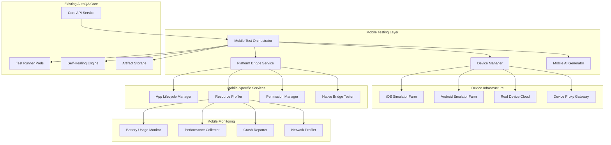

# Design Document: Mobile Platform Testing

## Overview

The Mobile Platform Testing feature extends AutoQA Pilot's autonomous web testing capabilities to support comprehensive mobile application testing across iOS and Android platforms. This design integrates mobile-specific testing infrastructure while maintaining the platform's core principles of AI-powered test generation, self-healing capabilities, and production-grade quality standards.

The mobile testing platform provides specialized testing for native mobile applications, hybrid apps, and mobile web applications with focus on platform-specific behaviors, performance characteristics, and user experience patterns unique to mobile environments.

## Architecture

### High-Level Mobile Testing Architecture



### Mobile Testing Integration Points

The mobile testing platform integrates with existing AutoQA Pilot components:

**Core API Extensions:**

- Mobile project configuration endpoints
- Device management APIs
- Mobile-specific test scenario creation
- Platform-specific execution triggers

**Test Runner Enhancements:**

- Mobile test execution containers with platform SDKs
- Device connection and management
- Mobile artifact capture (screenshots, logs, performance data)
- Platform-specific test result processing

**Self-Healing Engine Extensions:**

- Mobile element location strategies
- Platform-specific UI element identification
- Touch gesture recognition and adaptation
- Mobile-specific error recovery patterns

## Components and Interfaces

### 1. Mobile Test Orchestrator

**Technology Stack:**

- Node.js/TypeScript service
- WebDriver/Appium integration
- Kubernetes job management
- Redis for device queue management

**Production Standards:**

- Connection pooling for device communications
- Timeout handling for mobile operations (60s default)
- Resource cleanup after test completion
- Correlation ID propagation for mobile test flows
- Circuit breaker for device communication failures

**Core Responsibilities:**

```typescript
interface MobileTestOrchestrator {
  // Test execution management
  executeTest(
    testId: string,
    deviceConfig: DeviceConfiguration
  ): Promise<TestExecution>;
  scheduleTest(testId: string, schedule: TestSchedule): Promise<ScheduledTest>;
  cancelTest(executionId: string): Promise<void>;

  // Device coordination
  allocateDevice(requirements: DeviceRequirements): Promise<DeviceAllocation>;
  releaseDevice(deviceId: string): Promise<void>;
  getDeviceStatus(deviceId: string): Promise<DeviceStatus>;

  // Platform-specific operations
  installApp(deviceId: string, appPath: string): Promise<InstallResult>;
  uninstallApp(deviceId: string, bundleId: string): Promise<void>;
  captureDeviceState(deviceId: string): Promise<DeviceSnapshot>;
}

interface DeviceConfiguration {
  platform: 'ios' | 'android';
  version: string;
  deviceType: 'simulator' | 'emulator' | 'real';
  screenSize: ScreenDimensions;
  capabilities: DeviceCapabilities;
}

interface DeviceRequirements {
  platform: 'ios' | 'android';
  minVersion: string;
  maxVersion?: string;
  deviceTypes: ('simulator' | 'emulator' | 'real')[];
  requiredCapabilities: string[];
  parallelInstances?: number;
}
```

### 2. Device Manager

**Technology Stack:**

- Docker containers for simulators/emulators
- iOS Simulator management via simctl
- Android Emulator management via avdmanager
- Real device integration via device farms (AWS Device Farm, Firebase Test Lab)

**Production Standards:**

- Device pool management with health checks
- Automatic device cleanup and reset
- Resource monitoring (CPU, memory, disk)
- Device allocation fairness and load balancing
- Concurrent device limit enforcement

**Device Management Features:**

```typescript
interface DeviceManager {
  // Device lifecycle
  createDevice(config: DeviceConfiguration): Promise<Device>;
  startDevice(deviceId: string): Promise<void>;
  stopDevice(deviceId: string): Promise<void>;
  resetDevice(deviceId: string): Promise<void>;
  deleteDevice(deviceId: string): Promise<void>;

  // Device monitoring
  getDeviceHealth(deviceId: string): Promise<DeviceHealth>;
  monitorDeviceResources(deviceId: string): AsyncIterable<ResourceMetrics>;

  // Device pool management
  getAvailableDevices(requirements: DeviceRequirements): Promise<Device[]>;
  reserveDevice(deviceId: string, duration: number): Promise<Reservation>;
  releaseReservation(reservationId: string): Promise<void>;
}

interface Device {
  id: string;
  platform: 'ios' | 'android';
  version: string;
  type: 'simulator' | 'emulator' | 'real';
  status: 'available' | 'busy' | 'maintenance' | 'offline';
  capabilities: DeviceCapabilities;
  location: DeviceLocation;
  lastHealthCheck: Date;
}

interface DeviceHealth {
  status: 'healthy' | 'degraded' | 'unhealthy';
  cpuUsage: number;
  memoryUsage: number;
  diskSpace: number;
  networkLatency: number;
  lastError?: string;
}
```

### 3. Platform Bridge Service

**Technology Stack:**

- Appium WebDriver for cross-platform automation
- iOS-specific: XCUITest framework integration
- Android-specific: UiAutomator2 integration
- Native bridge communication protocols

**Production Standards:**

- Platform-specific error handling and recovery
- Performance optimization for mobile operations
- Memory management for long-running tests
- Proper cleanup of platform resources
- Security isolation between test sessions

**Platform Abstraction:**

```typescript
interface PlatformBridge {
  // App lifecycle operations
  launchApp(deviceId: string, bundleId: string): Promise<void>;
  backgroundApp(deviceId: string): Promise<void>;
  foregroundApp(deviceId: string): Promise<void>;
  terminateApp(deviceId: string, bundleId: string): Promise<void>;

  // UI interaction
  findElement(deviceId: string, selector: ElementSelector): Promise<Element>;
  tap(deviceId: string, element: Element): Promise<void>;
  swipe(deviceId: string, gesture: SwipeGesture): Promise<void>;
  typeText(deviceId: string, element: Element, text: string): Promise<void>;

  // Platform-specific operations
  handlePermissionDialog(
    deviceId: string,
    action: PermissionAction
  ): Promise<void>;
  captureScreenshot(deviceId: string): Promise<Buffer>;
  getAppState(deviceId: string, bundleId: string): Promise<AppState>;

  // Native bridge testing
  callNativeMethod(
    deviceId: string,
    method: string,
    params: any[]
  ): Promise<any>;
  validateBridgeResponse(response: any, expected: any): boolean;
}

interface ElementSelector {
  strategy: 'id' | 'xpath' | 'class' | 'accessibility' | 'predicate';
  value: string;
  platform?: 'ios' | 'android';
}

interface SwipeGesture {
  startX: number;
  startY: number;
  endX: number;
  endY: number;
  duration: number;
}
```

### 4. Mobile AI Generator

**Technology Stack:**

- OpenAI GPT-4 with mobile-specific prompts
- Platform-specific code generation templates
- Mobile UI element recognition models
- Natural language to mobile test conversion

**Production Standards:**

- Mobile-specific prompt engineering
- Platform-aware code generation
- Input validation for mobile contexts
- Generated code security scanning
- Mobile test pattern recognition

**AI Generation Capabilities:**

```typescript
interface MobileAIGenerator {
  // Test generation
  generateMobileTest(
    description: string,
    platform: 'ios' | 'android'
  ): Promise<MobileTestScript>;
  generateGestureSequence(userIntent: string): Promise<GestureSequence>;
  generatePermissionFlow(permissions: string[]): Promise<PermissionTestFlow>;

  // Platform-specific generation
  generateiOSTest(
    description: string,
    targetVersion: string
  ): Promise<iOSTestScript>;
  generateAndroidTest(
    description: string,
    targetVersion: string
  ): Promise<AndroidTestScript>;

  // Self-healing for mobile
  suggestAlternativeSelectors(
    failedSelector: ElementSelector,
    context: MobileContext
  ): Promise<ElementSelector[]>;
  adaptTestForPlatformVersion(
    test: MobileTestScript,
    targetVersion: string
  ): Promise<MobileTestScript>;
}

interface MobileTestScript {
  id: string;
  platform: 'ios' | 'android';
  steps: MobileTestStep[];
  assertions: MobileAssertion[];
  setup: MobileTestSetup;
  teardown: MobileTestTeardown;
}

interface MobileTestStep {
  type:
    | 'launch'
    | 'tap'
    | 'swipe'
    | 'type'
    | 'wait'
    | 'assert'
    | 'permission'
    | 'background';
  target?: ElementSelector;
  value?: string;
  gesture?: SwipeGesture;
  timeout?: number;
  platform?: 'ios' | 'android';
}
```

### 5. App Lifecycle Manager

**Technology Stack:**

- Platform-specific lifecycle monitoring
- Background task tracking
- App state transition detection
- Push notification simulation

**Production Standards:**

- Accurate lifecycle event capture
- Memory leak detection during transitions
- Performance impact measurement
- State persistence validation
- Background task completion tracking

**Lifecycle Management:**

```typescript
interface AppLifecycleManager {
  // Lifecycle monitoring
  monitorAppLifecycle(
    deviceId: string,
    bundleId: string
  ): AsyncIterable<LifecycleEvent>;
  simulateLifecycleTransition(
    deviceId: string,
    transition: LifecycleTransition
  ): Promise<void>;

  // Background task testing
  startBackgroundTask(
    deviceId: string,
    taskConfig: BackgroundTaskConfig
  ): Promise<BackgroundTask>;
  monitorBackgroundTask(taskId: string): AsyncIterable<BackgroundTaskStatus>;
  validateTaskCompletion(taskId: string): Promise<TaskCompletionResult>;

  // Push notification testing
  sendTestNotification(
    deviceId: string,
    notification: TestNotification
  ): Promise<void>;
  validateNotificationDelivery(
    deviceId: string,
    notificationId: string
  ): Promise<DeliveryStatus>;

  // State management
  captureAppState(
    deviceId: string,
    bundleId: string
  ): Promise<AppStateSnapshot>;
  restoreAppState(deviceId: string, snapshot: AppStateSnapshot): Promise<void>;
  validateStateRestoration(
    before: AppStateSnapshot,
    after: AppStateSnapshot
  ): boolean;
}

interface LifecycleEvent {
  timestamp: Date;
  event:
    | 'launch'
    | 'background'
    | 'foreground'
    | 'terminate'
    | 'suspend'
    | 'resume';
  bundleId: string;
  metadata: Record<string, any>;
}

interface BackgroundTaskConfig {
  type: 'location' | 'sync' | 'processing' | 'download';
  duration: number;
  expectedBehavior: 'complete' | 'suspend' | 'terminate';
  resourceLimits: ResourceLimits;
}
```

### 6. Resource Profiler

**Technology Stack:**

- iOS Instruments integration
- Android systrace/perfetto integration
- Custom performance metrics collection
- Battery usage analysis tools

**Production Standards:**

- Real-time performance monitoring
- Memory leak detection
- CPU usage optimization
- Network efficiency analysis
- Battery drain measurement accuracy

**Performance Monitoring:**

```typescript
interface ResourceProfiler {
  // Performance profiling
  startProfiling(
    deviceId: string,
    config: ProfilingConfig
  ): Promise<ProfilingSession>;
  stopProfiling(sessionId: string): Promise<PerformanceReport>;

  // Battery monitoring
  monitorBatteryUsage(
    deviceId: string,
    duration: number
  ): Promise<BatteryReport>;
  measureWakeLockUsage(
    deviceId: string,
    bundleId: string
  ): Promise<WakeLockReport>;

  // Memory profiling
  captureMemorySnapshot(
    deviceId: string,
    bundleId: string
  ): Promise<MemorySnapshot>;
  detectMemoryLeaks(snapshots: MemorySnapshot[]): Promise<MemoryLeakReport>;

  // Network profiling
  monitorNetworkUsage(
    deviceId: string,
    bundleId: string
  ): AsyncIterable<NetworkMetrics>;
  analyzeNetworkEfficiency(
    metrics: NetworkMetrics[]
  ): Promise<NetworkEfficiencyReport>;

  // CPU profiling
  profileCPUUsage(
    deviceId: string,
    bundleId: string,
    duration: number
  ): Promise<CPUReport>;
  identifyPerformanceBottlenecks(
    report: CPUReport
  ): Promise<BottleneckAnalysis>;
}

interface ProfilingConfig {
  metrics: ('cpu' | 'memory' | 'network' | 'battery' | 'gpu')[];
  samplingRate: number;
  duration: number;
  includeSystemMetrics: boolean;
}

interface PerformanceReport {
  sessionId: string;
  duration: number;
  metrics: {
    cpu: CPUMetrics;
    memory: MemoryMetrics;
    network: NetworkMetrics;
    battery: BatteryMetrics;
  };
  anomalies: PerformanceAnomaly[];
  recommendations: string[];
}
```

## Data Models

### Mobile Test Configuration

```typescript
interface MobileProject extends BaseProject {
  mobileConfig: {
    platforms: ('ios' | 'android')[];
    targetVersions: {
      ios?: string[];
      android?: string[];
    };
    deviceRequirements: DeviceRequirements;
    appConfiguration: AppConfiguration;
    testingScope: TestingScope;
  };
}

interface AppConfiguration {
  bundleId: string;
  appPath?: string;
  installationMethod: 'local' | 'store' | 'enterprise';
  permissions: Permission[];
  deepLinks: DeepLink[];
  pushNotifications: PushNotificationConfig;
}

interface TestingScope {
  includeLifecycleTesting: boolean;
  includePerformanceProfiling: boolean;
  includePermissionTesting: boolean;
  includeNativeBridgeTesting: boolean;
  backgroundTaskTesting: boolean;
  batteryOptimizationTesting: boolean;
}
```

### Mobile Test Execution

```typescript
interface MobileTestExecution extends BaseTestExecution {
  deviceAllocation: DeviceAllocation;
  platformSpecificData: {
    appVersion: string;
    osVersion: string;
    deviceModel: string;
    screenResolution: ScreenDimensions;
    performanceMetrics: PerformanceMetrics;
    batteryUsage: BatteryUsage;
    memoryUsage: MemoryUsage;
  };
  mobileArtifacts: {
    screenshots: Screenshot[];
    performanceReports: PerformanceReport[];
    crashLogs: CrashLog[];
    networkLogs: NetworkLog[];
    systemLogs: SystemLog[];
  };
}

interface DeviceAllocation {
  deviceId: string;
  reservationId: string;
  allocatedAt: Date;
  expiresAt: Date;
  cost: number;
  region: string;
}
```

### Mobile-Specific Artifacts

```typescript
interface MobileScreenshot extends Screenshot {
  deviceOrientation: 'portrait' | 'landscape';
  safeAreaInsets: SafeAreaInsets;
  statusBarHeight: number;
  navigationBarHeight: number;
  devicePixelRatio: number;
}

interface PerformanceMetrics {
  cpuUsage: CPUUsage[];
  memoryUsage: MemoryUsage[];
  networkActivity: NetworkActivity[];
  batteryDrain: BatteryDrain[];
  frameRate: FrameRateMetrics[];
  appLaunchTime: number;
  responseTime: ResponseTimeMetrics[];
}

interface SafeAreaInsets {
  top: number;
  bottom: number;
  left: number;
  right: number;
}
```

## Correctness Properties

_A property is a characteristic or behavior that should hold true across all valid executions of a system—essentially, a formal statement about what the system should do. Properties serve as the bridge between human-readable specifications and machine-verifiable correctness guarantees._

Based on the mobile platform testing requirements (35.1-35.4), I need to analyze the acceptance criteria for testability:

<function_calls>
<invoke name="prework">
<parameter name="featureName">mobile-platform-testing

### Property Reflection

After analyzing the mobile platform testing requirements, I identified four main testable properties:

1. **Background task completion property** - Tests that background tasks either complete successfully or fail gracefully
2. **Resource management property** - Tests that wake locks are released and location tracking stops appropriately
3. **UI rendering property** - Tests that UI renders correctly across all screen configurations
4. **Bridge reliability property** - Tests that native bridge errors don't crash the app

These properties are complementary and each provides unique validation value:

- Property 1 focuses on task lifecycle management
- Property 2 focuses on resource cleanup and battery optimization
- Property 3 focuses on UI adaptation and accessibility
- Property 4 focuses on native integration stability

No redundancy was identified as each property tests different aspects of mobile platform behavior.

### Mobile Platform Testing Properties

Based on the prework analysis, here are the correctness properties for mobile platform testing:

**Property 1: Background Task Completion**
_For any_ mobile application and any background task, when the app is backgrounded, the background task should either complete successfully within its allocated time or gracefully fail with proper cleanup
**Validates: Requirements 35.1**

**Property 2: Resource Management Consistency**  
_For any_ mobile application using system resources (wake locks, location services, network), when the app is backgrounded or terminated, all acquired resources should be properly released within a reasonable timeout period
**Validates: Requirements 35.2**

**Property 3: UI Adaptation Universality**
_For any_ mobile UI component and any device configuration (screen size, orientation, safe areas), the UI should render correctly without overlapping system UI elements and handle permission dialogs gracefully
**Validates: Requirements 35.3**

**Property 4: Native Bridge Reliability**
_For any_ native module bridge communication, bridge errors should never crash the application and should propagate error information to the JavaScript layer in a consistent format
**Validates: Requirements 35.4**

## Error Handling

### Mobile-Specific Error Scenarios

**Device Communication Failures:**

- Device disconnection during test execution
- Simulator/emulator startup failures
- Network connectivity issues with real devices
- Device resource exhaustion (memory, storage)

**Platform-Specific Errors:**

- iOS code signing and provisioning issues
- Android SDK version compatibility problems
- Permission dialog handling failures
- App installation and launch failures

**Performance and Resource Errors:**

- Memory leaks during long-running tests
- Battery drain threshold violations
- CPU usage spikes during profiling
- Network timeout during resource monitoring

**Error Recovery Strategies:**

```typescript
interface MobileErrorHandler {
  // Device error recovery
  handleDeviceDisconnection(deviceId: string): Promise<RecoveryAction>;
  retryDeviceOperation(
    operation: DeviceOperation,
    maxRetries: number
  ): Promise<OperationResult>;

  // Platform error recovery
  handleAppCrash(deviceId: string, bundleId: string): Promise<CrashRecovery>;
  recoverFromPermissionFailure(
    deviceId: string,
    permission: Permission
  ): Promise<PermissionRecovery>;

  // Resource error recovery
  handleResourceExhaustion(
    deviceId: string,
    resource: ResourceType
  ): Promise<ResourceRecovery>;
  cleanupAfterTestFailure(executionId: string): Promise<void>;
}

enum RecoveryAction {
  RETRY_SAME_DEVICE = 'retry_same_device',
  ALLOCATE_NEW_DEVICE = 'allocate_new_device',
  SKIP_TEST = 'skip_test',
  FAIL_EXECUTION = 'fail_execution',
}
```

### Error Monitoring and Alerting

**Real-time Error Detection:**

- Device health monitoring with automated alerts
- Performance threshold violations
- Resource usage anomaly detection
- Test execution failure pattern analysis

**Error Reporting Integration:**

- Crash reporting for mobile applications under test
- Device farm error aggregation
- Performance regression detection
- Battery usage anomaly alerts

## Testing Strategy

### Dual Testing Approach

The mobile platform testing feature requires both unit tests and property-based tests to ensure comprehensive coverage:

**Unit Tests Focus:**

- Specific device configuration scenarios
- Platform-specific API integration points
- Error handling for known failure modes
- Mock device interactions for development
- Edge cases in resource management

**Property-Based Tests Focus:**

- Universal mobile behavior across all device types
- Resource management properties across all apps
- UI rendering consistency across all screen configurations
- Bridge communication reliability across all native modules

### Property-Based Testing Configuration

**Testing Framework:** fast-check with minimum 100 iterations per property test
**Mobile-Specific Generators:**

- Device configuration generators (iOS/Android versions, screen sizes)
- App lifecycle state generators
- Resource usage pattern generators
- UI element selector generators
- Native bridge call generators

**Property Test Implementation:**

```typescript
// Example property test structure
describe('Mobile Platform Properties', () => {
  /**
   * Property Test: Background Task Completion
   * **Feature: mobile-platform-testing, Property 1: Background task completion**
   */
  it('should complete or gracefully fail background tasks when app is backgrounded', async () => {
    await fc.assert(
      fc.asyncProperty(
        fc.record({
          deviceConfig: deviceConfigGenerator(),
          backgroundTask: backgroundTaskGenerator(),
          appState: appStateGenerator(),
        }),
        async ({ deviceConfig, backgroundTask, appState }) => {
          // Test implementation
          const result = await testBackgroundTaskCompletion(
            deviceConfig,
            backgroundTask,
            appState
          );
          expect(result.status).toMatch(/^(completed|gracefully_failed)$/);
          expect(result.resourcesReleased).toBe(true);
        }
      ),
      { numRuns: 100 }
    );
  });
});
```

### Integration Testing Strategy

**Device Farm Integration:**

- Automated testing across multiple iOS and Android versions
- Real device testing for performance validation
- Simulator/emulator testing for rapid feedback
- Cross-platform compatibility validation

**Performance Testing:**

- Battery usage benchmarking
- Memory leak detection across test runs
- CPU usage profiling under load
- Network efficiency validation

**Security Testing:**

- Permission handling validation
- Data isolation between test runs
- Secure communication with device farms
- Sensitive data cleanup verification

### Test Environment Management

**Device Pool Management:**

- Automated device provisioning and cleanup
- Health monitoring and maintenance scheduling
- Load balancing across available devices
- Cost optimization for cloud device usage

**Test Data Management:**

- Test app deployment and versioning
- Test data isolation and cleanup
- Performance baseline management
- Artifact storage and retention policies

## Implementation Phases

### Phase 1: Core Mobile Infrastructure (Week 1-2)

- Mobile Test Orchestrator implementation
- Device Manager with simulator/emulator support
- Basic Platform Bridge Service
- Integration with existing AutoQA API

### Phase 2: iOS Platform Support (Week 3-4)

- iOS Simulator management
- XCUITest integration
- iOS-specific UI element handling
- App lifecycle testing for iOS

### Phase 3: Android Platform Support (Week 5-6)

- Android Emulator management
- UiAutomator2 integration
- Android-specific UI element handling
- App lifecycle testing for Android

### Phase 4: Performance and Resource Monitoring (Week 7-8)

- Resource Profiler implementation
- Battery usage monitoring
- Memory leak detection
- Performance metrics collection

### Phase 5: Advanced Features (Week 9-10)

- Native bridge testing
- Real device integration
- Advanced AI-powered test generation
- Self-healing for mobile elements

### Phase 6: Production Hardening (Week 11-12)

- Security hardening and isolation
- Performance optimization
- Comprehensive error handling
- Production monitoring and alerting

## Security Considerations

### Device Isolation

- Complete isolation between test sessions
- Secure device communication protocols
- Data encryption for device communications
- Network isolation for security testing

### App Security Testing

- Permission boundary testing
- Data leakage prevention validation
- Secure storage verification
- Network security testing

### Infrastructure Security

- Secure device farm integration
- API authentication and authorization
- Audit logging for all mobile operations
- Compliance with mobile security standards

## Monitoring and Observability

### Mobile-Specific Metrics

- Device utilization and availability
- Test execution success rates by platform
- Performance metrics trends
- Resource usage optimization metrics

### Alerting Strategy

- Device health degradation alerts
- Performance threshold violations
- Test execution failure spikes
- Resource usage anomalies

### Dashboard Integration

- Real-time device status monitoring
- Mobile test execution analytics
- Performance trend visualization
- Cost optimization insights

## Scalability and Performance

### Horizontal Scaling

- Auto-scaling device pools based on demand
- Load balancing across multiple device farms
- Geographic distribution for reduced latency
- Cost-optimized device allocation

### Performance Optimization

- Efficient device resource utilization
- Parallel test execution optimization
- Artifact compression and storage optimization
- Network bandwidth optimization for device communication

### Cost Management

- Dynamic device allocation based on test requirements
- Automated cleanup and resource release
- Usage-based cost tracking and optimization
- Reserved capacity planning for predictable workloads
